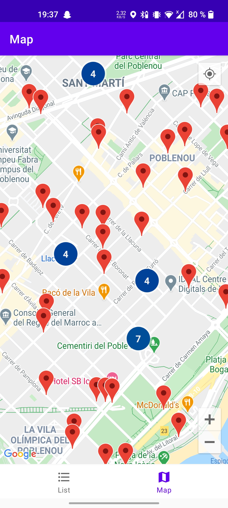
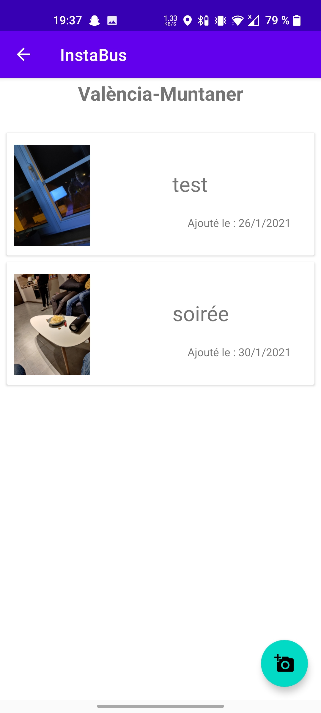

# Instabus
Instabus est une application android qui vous permet de lister et voir sur une carte les arrêts de bus de Barcelone. Ainsi, vous pourrez y lier des photos prises de ces arrêts depuis votre télephone.

## Screenshots

